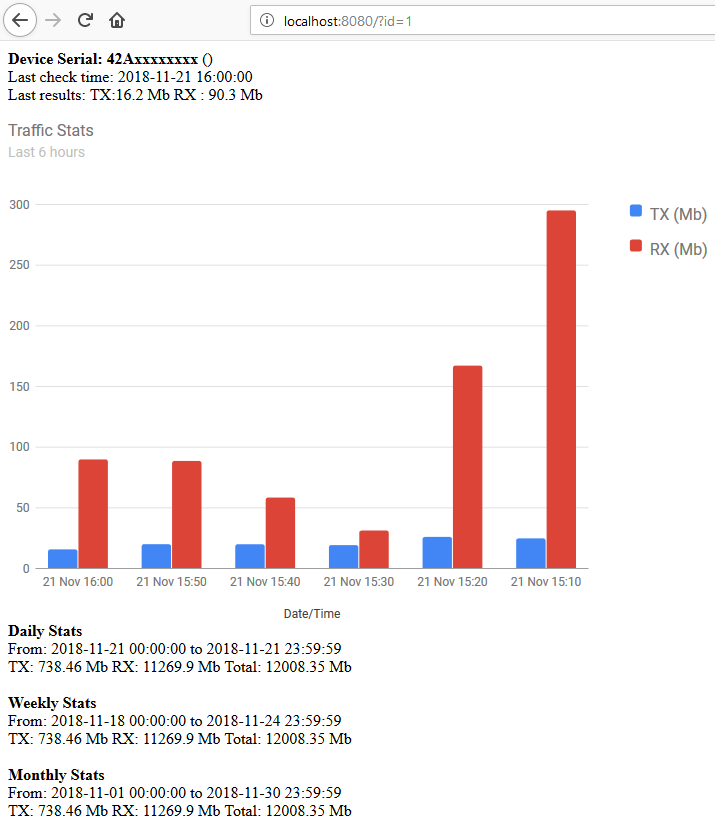

# Simple Mikrotik Traffic Counter
A simple PHP application to collect interface statistics from Mikrotik router and display the usage (upload/download).
You can host this application anywhere on the network or Internet.

### Features
- Collect tx/rx stats from routerboard.
- Display hourly graph.
- Display daily/weekly/monthly summary.

## Usage
Setup the Mikrotik router to collect and send the stats to the application first.

1. Create firewall mangle rules that will collect the traffic stats.
```
/ip firewall mangle
  add chain=forward src-address=192.168.88.0/24 out-interface=pppoe-out1 action=passthrough comment=local-wan-tx
  add chain=forward dst-address=192.168.88.0/24 in-interface=pppoe-out1 action=passthrough comment=local-wan-rx
```
Here, I am monitoring usage for a specific subnet, going through a PPP connection for Internet.

2. Add the following script that will get the data and send it to the application.
```
:local wantxcomment "local-wan-tx"
:local wanrxcomment "local-wan-rx"
:local sysnumber [/system routerboard get value-name=serial-number]
:local txbytes [/ip firewall mangle get [/ip firewall mangle find comment="$wantxcomment"] bytes]
:local rxbytes [/ip firewall mangle get [/ip firewall mangle find comment="$wanrxcomment"] bytes]
/tool fetch url=("http://<server ip/url>/collector.php\?sn=$sysnumber&tx=$txbytes&rx=$rxbytes") mode=http keep-result=no
/ip firewall mangle reset-counters [/ip firewall mangle find comment="$wantxcomment"]
/ip firewall mangle reset-counters [/ip firewall mangle find comment="$wanrxcomment"]
:log info ("cleared counters for all mangle rules")
```
Edit the `<server ip/url>` to match where application is hosted.

3. Set a scheduler to run the script at 1 hour intervals.
```
/system scheduler add name="upload-traffic-count-local" interval=1h on-event=<script name>
```
Edit the `<script name>` to match the actual script.

4. View in application after script is run.

## Sample Screenshot


## Author
Mohamed Muhannad ([@monde_](https://twitter.com/monde_))

## Acknowledgements
- [tikstat](https://github.com/mrkrasser/tikstat) project
- [Mikrotik: WAN Data Monitoring via Scripting](https://aacable.wordpress.com/2015/03/09/5386/) by Syed Janazaib
